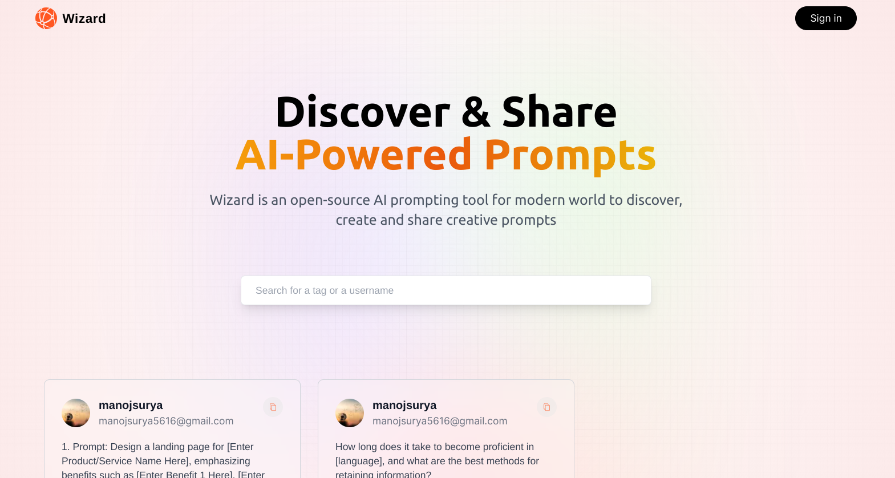
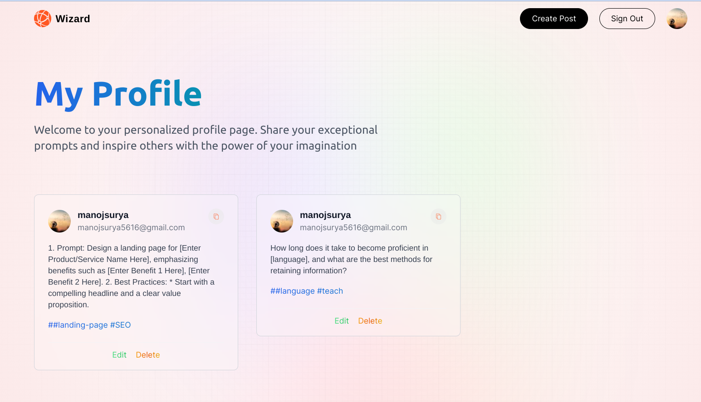

---
Welcome to Wizard AI, the official marketplace to share and discover AI prompts.

The WIZARD web app is a user-friendly web application designed to empower creative thinkers, writers, and AI enthusiasts to explore, discover, and share a wide array of artificial intelligence-generated prompts. Whether you're an aspiring writer seeking inspiration, an AI developer looking to experiment, or simply curious about AI-generated content, our platform provides a versatile and collaborative space for all.


# **Requirements**
To run the project, you need:
- Node 18 LTS
- Next.JS 13+

# **Features**
Our platform offers several unique and engaging features to explore:


## **Authentication and Account Management**
Our system ensures seamless and secure user experiences:
- Users can sign up using third-party authentication providers eg.google
- Users can log in using username and password
- Users can log out

## **Discover AI Prompts**
Users can search for prompts two ways:
- search based on users(by typing specific username or email) 
- Users can also search for prompts based on tags(eg. #SEO) which will filter and diplay only prompts with that tag.


## **Create and share Prompts**
- Users can create and add their own prompts to share with everyone.


## **Manage Posts**
- Users can edit and manage their prompts in their profile page.


# **Tech Stack**

This web app utilizes a robust set of modern technologies to deliver a high-quality user experience:

## **Frontend**

- **[Next.js](https://nextjs.org/)**: A React-based framework offering tools and conventions for server-side rendered (SSR) and statically generated web applications.

- **[Tailwind CSS](https://tailwindcss.com/)**: A utility-first CSS framework promoting highly customizable and responsive design.


## **Backend**

- **[Node.js](https://nodejs.org/en/)**: A JavaScript runtime environment that executes JavaScript code outside of a web browser.

- **[MongoDB](https://www.mongodb.com/)**: This project leverages MongoDB, a powerful and flexible NoSQL database, to store and manage our data. MongoDB is a popular choice for applications that require scalable and dynamic data storage, making it an ideal solution for our needs.


- **[Next Auth](https://clerk.com/)**: A user-friendly authentication and user management platform. next-Auth provides multiple authentication strategies and a comprehensive user management system. It is secure, scalable, and easy to use, with customizable UI components.


# **Running Application Locally**

## 1. **Clone the Project Locally**
Open your terminal and use the following command to clone the project:
```sh
git clone https://github.com/mj-gowda/wizard.git
```

## 2. **Install Dependencies**
Navigate to the project's root directory and install the required dependencies using the following command:
```sh
yarn install
```

## 3. **Set Up Environment Variables**
Create a copy of the `.env.example` file and rename it to `.env.local`. Populate the `.env.local` with the necessary secrets.


## 6. **Run Project**
Once you've set up the environment variables, Prisma, and Stripe, use the following commands to run the project:

In one terminal, run the Next.js server:
```sh
yarn dev
```

This should run the project on `localhost:3000`.
